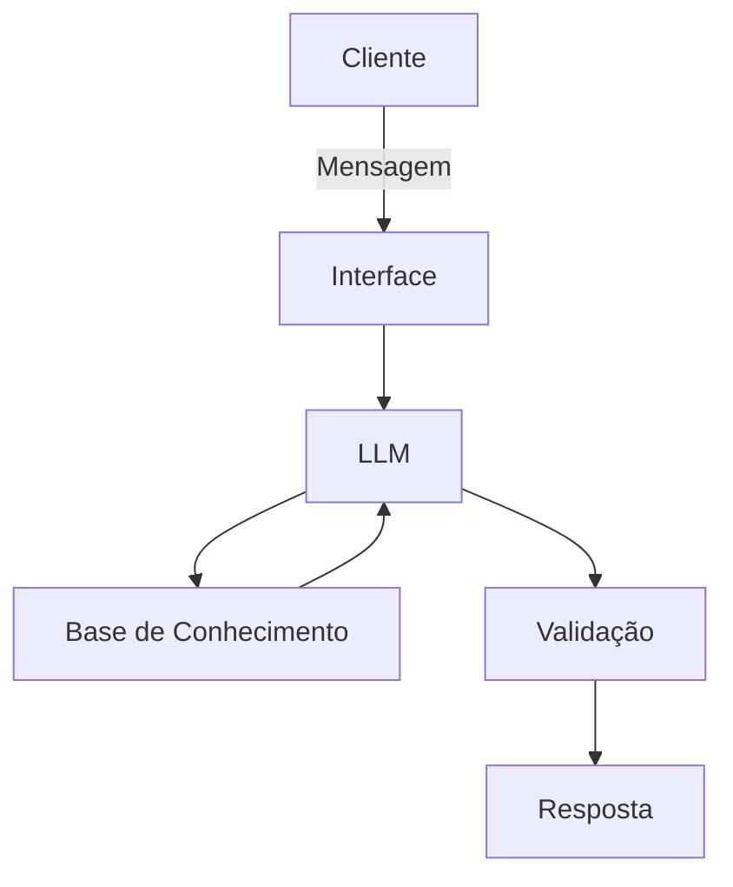

# Documentação do Agente

## Caso de Uso

### Problema
> Qual problema financeiro seu agente resolve?

O gerenciamento financeiro tradicional exige planilhas, cálculos e acompanhamento constante, tornando o processo cansativo e pouco acessível para usuários comuns.

### Solução
> Como o agente resolve esse problema de forma proativa?

O sistema automatiza categorização de gastos, criação de relatórios e envio de alertas financeiros, reduzindo esforço manual e ajudando o usuário a tomar decisões mais conscientes.

### Público-Alvo
> Quem vai usar esse agente?

Pessoas que desejam melhorar organização financeira, controlar gastos e economizar dinheiro no dia a dia.

---

## Persona e Tom de Voz

### Nome do Agente
Nexo Finance

### Personalidade
> Como o agente se comporta? (ex: consultivo, direto, educativo)

O agente se comunica como um assistente pessoal financeiro, mantendo interação amigável, motivadora e acessível para usuários com pouco conhecimento em finanças.

### Tom de Comunicação
> Formal, informal, técnico, acessível?

O agente utiliza comunicação acessível, clara e amigável, evitando excesso de termos técnicos para facilitar o entendimento de usuários comuns.

### Exemplos de Linguagem
- Saudação: [ex: "Olá! Como posso ajudar com suas finanças hoje?"]
- Confirmação: [ex: "Entendi! Deixa eu verificar isso para você."]
- Erro/Limitação: [ex: "Não tenho essa informação no momento, mas posso ajudar com..."]

---

## Arquitetura

### Diagrama

### Componentes

| Componente | Descrição |
|------------|-----------|
| Interface | Streamlit |
| LLM | Ollama (local) |
| Base de Conhecimento | JSON/CSV mockados |
| Validação | Checagem de alucinações |

---

## Segurança e Anti-Alucinação

### Estratégias Adotadas

- [ ] O agente responde apenas com base nas informações fornecidas pelo usuário.
- [ ] O agente informa quando não possui dados suficientes para gerar uma resposta confiável.
- [ ] O agente não substitui consultoria financeira profissional.
- [ ] O agente não realiza recomendações de investimento sem análise do perfil do usuário.
- [ ] O agente prioriza privacidade e segurança dos dados financeiros do usuário.

### Limitações Declaradas

> O que o agente NÃO faz?

- O agente não substitui consultoria financeira profissional.
- O agente não garante precisão absoluta nas análises financeiras geradas.
- O agente depende das informações fornecidas pelo usuário para gerar respostas e recomendações.
- O agente não realiza operações bancárias ou transações financeiras.
- O agente não fornece recomendações de investimento personalizadas sem análise completa do perfil financeiro do usuário.
- O agente pode apresentar limitações na interpretação de informações incompletas ou ambíguas.
- O agente não possui acesso automático a contas bancárias ou dados financeiros externos sem autorização do usuário.
